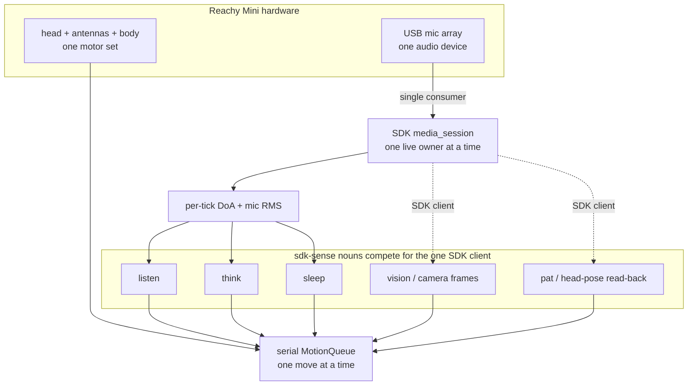

# Operating Reachy Mini

The coherent, end-to-end guide to running a **Reachy Mini** with
`reachy-mini-cli` — what it can do, the one model you must understand before you
compose behaviors (**the single-SDK-owner model**), how to bring the robot up
live, how to verify it, and how to get unstuck.

If you just want the copy-paste bring-up, run `reachy-mini-cli quickstart` (or jump to
[Bring Reachy up live](#bring-reachy-up-live)). If something is silently not
working, jump to [Troubleshooting](#troubleshooting) — the **`~/.asoundrc`
mic-array gotcha** is the most common silent failure.

> **Audience:** human operators bringing the robot up, AI agents driving the
> CLI, and contributors. Everything here is operator-facing; the implementation
> map for contributors is in [`CLAUDE.md`](../CLAUDE.md).

---

## What Reachy Mini can do

Reachy Mini is an expressive desk robot — a movable head (pitch/yaw + height),
two antennas, a rotating body, a USB **mic array** (with on-board direction-of-
arrival), a camera, and a speaker. `reachy-mini-cli` turns each capability into
a **noun** you run from the shell or an agent loop:

- **Hold a daemon** that owns the hardware (`daemon`), and run low-level
  device/app/motion ops against it (`device`, `app`, `move`).
- **Feel alive** when idle — gentle breathing, glances, antenna sway
  (`demo-mode`, `behavior`).
- **Orient to sound** — lean its antennas toward a voice and turn to face it
  (`listen`).
- **Orient to sight** — turn toward motion or light in the camera, no ML
  (`vision`).
- **Speak** — text-to-speech straight to the speaker (`say`).
- **Think out loud** — an LLM cognition loop that talks and moves its body in
  step with its thoughts, and can **export** a live feed of what it is
  thinking / saying / feeling (`think`, `think run --export`).
- **Feel a head pat and lean into it** — proprioceptive touch, no touch sensor
  (`pat`).
- **Fall asleep when left alone and wake when addressed** (`sleep`).

See the [noun map in the README](../README.md#noun-map) for the one-line table,
and `reachy-mini-cli explain <noun>` for the full reference of any noun.

---

## The single-SDK-owner model

**This is the one concept to understand before you run more than one behavior at
a time.** It trips up humans and agents repeatedly, because the CLI happily lets
you launch any two nouns — but the hardware underneath has **two single
resources**, and only one owner each.

### Two single resources



1. **The SDK client — and its single-consumer media session.** On the `sdk`
   transport every noun runs against **one in-process `ReachyMini` client**, and
   the robot serves a single live SDK client at a time. The mic path is the
   strictest case: `listen`, `think`, and `sleep` read live direction-of-arrival
   and loudness by opening a `media_session()` that is **single-consumer** —
   *"obtained exclusively through `SdkTransport.media_session`"*, against the
   *one* `ReachyMini` media subsystem (`reachy/robot/sdk_transport.py`). `vision`
   reads camera frames (`transport.get_frame()` → `media_manager.camera`) and
   `pat` reads the head pose back — both through that same one SDK client (these
   two do *not* open a `media_session()`; they contend at the `ReachyMini`-client
   level, which serializes all SDK access). So **only one `sdk`-sense noun can own
   the robot at a time.**

2. **The head — motion.** Every move (idle wander, sound-orienting turn,
   expression, snuggle, sleep-breathe) flows through **one serial
   `MotionQueue`**, one move at a time, so motion is always smooth and never
   self-conflicts. Two independent motion drivers still *fight over the same
   head*.

### What this means: the conflict matrix

Because both resources are single-owner, **you cannot run two `sdk`-sense nouns
as separate processes against one robot.** The second one contends for the
single-consumer SDK client and gets starved — a separate `pat` process running
alongside `listen` is throttled to roughly **1 Hz**, far too slow to feel a pat
(`reachy/motion/listen_pat.py`).

The `sdk`-sense nouns are `listen`, `think`, `sleep`, `vision`, and `pat`.

| Combination (both on `sdk`) | Works? | Why |
|---|---|---|
| any two of `listen` / `think` / `sleep` (two processes) | ❌ | Both open `media_session()` → contend for the one SDK client |
| `listen` + `pat` (two processes) | ❌ | Contend → `pat` throttled ~1 Hz. **This is why #43 folds pat into listen** |
| `listen`/`think`/`sleep` + `vision` (two processes) | ❌ | `vision` rides the same one SDK client for camera frames → contend |
| one sense noun + `demo-mode`/`behavior` | ⚠️ | No SDK-client clash (motion-only), but both drive the head — run **one** motion owner |
| one sense noun (`sdk`) + another noun (`http`) | ✅ | The `http` noun polls the daemon's DoA route and opens **no** SDK client |

### How to compose behaviors anyway

You have two correct patterns, and one coordination mechanism:

- **Fold senses into one loop (the #43 pattern).** Rather than run `pat`
  alongside `listen`, head-pat detection runs **inside** the `listen` loop via a
  per-tick `PatHook` — one process, one media session, both behaviors. This is
  the model for combining live senses on `sdk`.
- **Put the secondary noun on `--transport http`.** An `http`-transport noun
  polls the daemon's DoA route instead of opening a media session, so it never
  competes for the SDK client. Use this for a remote control box, or to layer a
  second behavior onto the one local `sdk` owner.
- **The `*_active.flag` files coordinate the shared *head*, not the media
  session.** When nouns are composed, `think`, `pat`, and `sleep` each drop a
  flag file under the state dir (`think_active.flag`, `pat_active.flag`,
  `sleep_active.flag`). The always-alive `listen` idle layer reads them and
  *yields the motion channel* by priority: `sleep` (strongest — yields
  entirely) > `pat` (pauses the idle wander) > `think` (drops to a quiet
  "focused breathe"). These flags solve head contention; they do **not** lift
  the single-media-session limit.

> **Rule of thumb:** one `sdk` media owner per robot. Everything else either
> folds into that loop or runs on `http`.

---

## Install profiles

Two profiles, because the SDK's transitive stack (pycairo / gstreamer /
pyaudio) needs system libraries a bare box or CI lacks — so `reachy-mini` is an
**extra**, not a base dependency (`numpy` is the only base runtime dep).

| Profile | Install | Use it for |
|---|---|---|
| **Real mode (recommended)** | `uv tool install 'reachy-mini-cli[daemon]'` (or `pip install 'reachy-mini-cli[daemon]'`) | A local robot: pulls `reachy-mini`, so the `sdk` transport and `reachy-mini-cli daemon start` work out of the box. |
| **HTTP remote** | `pip install reachy-mini-cli` (no extra) | No local robot — `numpy`-only; talk to a daemon elsewhere with `--transport http` + `REACHY_BASE_URL`. |

The installed command is **`reachy-mini-cli`** (short alias: `reachy`). Running
the `sdk` transport without the extra exits `2` with a hint to install `[sdk]` —
never a traceback. `reachy-cli` remains a transitional alias dist that just
pulls in `reachy-mini-cli`.

---

## Bring Reachy up live

The canonical sequence (also printed by `reachy-mini-cli quickstart`):

```bash
# 1. Install once (CLI + daemon binary + SDK)
uv tool install 'reachy-mini-cli[daemon]'

# 2. Start the daemon — wakes the robot on start
reachy-mini-cli daemon start

# 3. Verify it answers
reachy-mini-cli device status

# 4. Make it do something
reachy-mini-cli listen run            # orient to sound (Ctrl-C to stop)
#   or: reachy-mini-cli demo-mode start    # feel-alive idle loop (background)
#   or: reachy-mini-cli move goto --z 10 --pitch -5 --duration 2

# 5. Put it back down when you're done
reachy-mini-cli daemon stop
```

`reachy-mini-cli daemon start` spawns `reachy-mini-daemon` in the background and polls
its health route until ready (idempotent). It defaults to `--wake-up-on-start`,
so the robot wakes as part of step 2. Forward daemon args after `--`, e.g.
`reachy-mini-cli daemon start -- --sim --no-wake-up-on-start`. The daemon's PID + log
live under `$XDG_STATE_HOME/reachy` (`~/.local/state/reachy`).

### Transports — `sdk` vs `http`

Every robot noun talks to the hardware through a **transport**:

- **`sdk`** — the in-process `reachy_mini` client. The only transport that can
  open a `media_session()` (live mic DoA + RMS) or read the head pose back
  (`head_pose()`). **Default for the sense nouns** (`listen`, `think`, `pat`,
  `sleep`, `vision`). Needs the `[sdk]`/`[daemon]` extra.
- **`http`** — the daemon's REST API, pure stdlib. **Default for `device`,
  `app`, `move`** (and the base `transport.py` default). Point it with
  `--base-url` / `REACHY_BASE_URL` (default `http://localhost:8000`). It can
  poll the daemon's DoA route but cannot open a media session or read the head
  pose.

Select per command with `--transport {sdk,http}` or the `REACHY_TRANSPORT`
env var. If no daemon is reachable, the command exits `2` with a clean
`error:` / `hint:` pair.

> **Default differs by noun.** The sense nouns default to `sdk`; `device` /
> `app` / `move` default to `http`. `REACHY_TRANSPORT` overrides both.

---

## Boot persistence — one presence per reboot

By default nothing comes back after a reboot — you re-run `daemon start` and a
presence noun by hand. To make the robot a **self-healing, boot-surviving
presence**, use the `service` noun. It installs systemd `--user` units so the
robot boots into **exactly one** presence mode and auto-restarts on crash. This
is the single-SDK-owner model expressed across reboots: only one presence owns
the robot, so `service` lets you persist only one mode at a time.

### The two presence modes

| Mode | What boots | Best for |
|---|---|---|
| `demo` | `reachy-mini-cli demo-mode run` — the idle feel-alive loop | A robot that just looks present (breathing, glances, sway) |
| `live` | `reachy-mini-cli listen run --live` — the folded live sense loop | A robot that hears, sees, thinks, sleeps, and feels pats |

The `live` mode is the [folded live loop](#senses-one-sdk-media-owner-at-a-time):
**one** process running every live sense (hearing + pat + think + vision +
sleep) over the **one** SDK media session — the supported way to run all the
senses at once.

### The workflow

```bash
reachy-mini-cli service install          # write the three systemd --user units (enable nothing)
reachy-mini-cli service enable live      # boot-persist listen run --live
#   or: reachy-mini-cli service enable demo   # boot-persist the idle demo loop instead

reachy-mini-cli service status           # which mode is enabled (or none) + daemon health
reachy-mini-cli service disable          # stop the enabled presence (the daemon stays up)
reachy-mini-cli service uninstall        # remove the unit files
```

- **Exactly one presence is boot-persistent.** Enabling one mode **disables the
  sibling** — `service enable demo` after `service enable live` flips the robot
  to the idle loop and turns the live loop off. You never end up with two
  presences fighting for the robot.
- **It auto-restarts.** Each unit is `Restart=on-failure` with a 5 s back-off, so
  a presence that crashes comes straight back.
- **The daemon is a boot dependency.** `service` writes a `reachy-daemon.service`
  unit and the presence units `Requires=` / `After=` it, so the daemon is always
  up first. `service disable` stops only the presence and **leaves the daemon
  enabled** (other clients of the robot depend on it) — reported as
  `daemon=left-enabled`.
- **`install` vs `enable`.** `install` writes all three unit files and reloads
  systemd **without enabling anything**, so you can stage the units and choose the
  mode separately; `enable {demo|live}` is the all-in-one (write + enable + disable
  the sibling). Every verb supports `--json`.

> **Reboot at machine power-on needs linger.** A `systemctl --user` service
> normally starts at **first login**, not at machine boot. For a headless robot
> that should come up before anyone logs in, enable **linger** for the user:
> `loginctl enable-linger $USER`. A true machine-reboot check (power-cycle the
> robot, confirm the presence comes back on its own) is therefore a **manual
> on-robot step** — it is not something the CLI can self-verify.

Unit files live under `$XDG_CONFIG_HOME/systemd/user` (`~/.config/systemd/user`).
A missing `systemctl` on PATH exits `2` with a hint (this needs a Linux systemd
user session); an invalid mode is an exit-1 user error. Run
`reachy-mini-cli explain service` for the full reference.

---

## Verify it's working

A quick liveness checklist after `daemon start`:

```bash
reachy-mini-cli device status            # -> state, version, wireless/lite, sim, IP (exit 0)
reachy-mini-cli device state             # -> live head pose / antennas / body yaw
reachy-mini-cli say run "hello"          # you should hear it (checks TTS + speaker)
reachy-mini-cli move goto --z 10 --pitch -5 --duration 2   # head visibly moves
reachy-mini-cli listen run               # speak near it — antennas lean, then it turns; Ctrl-C
```

What "working" looks like:

- `device status` returns **exit 0** with real fields (not an exit-2 `hint:` to
  start the daemon).
- During `listen run`, the log shows antenna leans on every sound and a
  head→body turn on speech/snap. If the head never reacts to sound, you are
  almost certainly hitting the [`~/.asoundrc` gotcha](#the-asoundrc-mic-array-gotcha)
  below — the SDK opened but found no live mic source.
- `reachy-mini-cli <noun> status --json` (for `demo-mode` / `listen` / `think` / `sleep`)
  reports the background process + health.

---

## The `~/.asoundrc` mic-array gotcha

**The single most common silent failure.** The Reachy Mini mic array enumerates
as a USB audio **card** in ALSA, but PulseAudio/PipeWire may not expose it as a
capture **source**. When that happens the SDK falls back to the default audio
device and `listen` / `think` / `sleep` get **no real sound** — they run, but
the robot never reacts.

**Symptom** (in the daemon log):

```text
No Reachy Mini Audio Source card found / using default audio source
```

**Cause:** the host's PulseAudio/PipeWire has not surfaced the Reachy USB audio
card as an ALSA source, so the SDK cannot capture from the mic array.

**Fix:** the daemon is meant to auto-write an `~/.asoundrc` that pins the card
as `reachymini_audio_src` (its `write_asoundrc_to_home()` step) — but it does
not always fire on first bring-up. Ensure `~/.asoundrc` defines the
`reachymini_audio_src` ALSA device and restart the daemon:

```bash
reachy-mini-cli daemon stop
reachy-mini-cli daemon start
```

**Confirmation** — a healthy capture path logs:

```text
Using ALSA device reachymini_audio_src for capture
```

> The auto-write and the exact log strings live in the **daemon binary**
> (`reachy-mini`), not in `reachy-mini-cli`. The strings above were captured
> from a live bring-up; the exact `write_asoundrc_to_home()` behavior should be
> re-confirmed against the daemon during on-robot verification (see the
> [live-verify follow-up](#status--follow-ups)).

---

## Environment variables

Every variable the CLI reads, in one place. CLI flags override env vars; env
vars override the built-in default.

| Variable | Default | Meaning | Read by |
|---|---|---|---|
| `REACHY_TRANSPORT` | `sdk` for sense nouns; `http` for `device`/`app`/`move` | Selects the transport flavor | `robot/transport.py`, every sense noun |
| `REACHY_BASE_URL` | `http://localhost:8000` | Daemon REST base URL for the `http` transport | `robot/transport.py`, `daemon.py` |
| `REACHY_DAEMON_CMD` | (auto-resolved) | Override the `reachy-mini-daemon` binary/command `daemon start` spawns | `daemon.py` |
| `REACHY_STATE_DIR` | `$XDG_STATE_HOME/reachy` → `~/.local/state/reachy` | Where PID + log files for daemon/`demo-mode`/`listen`/`think`/`sleep` live | `daemon.py` |
| `XDG_STATE_HOME` | `~/.local/state` | Base for the state dir when `REACHY_STATE_DIR` is unset | `daemon.py` |
| `XDG_CONFIG_HOME` | `~/.config` | Base for config (`<…>/reachy/demo-mode.json`) | `demo_config.py` |
| `REACHY_TTS_URL` | `http://localhost:9000` | Magpie-style TTS HTTP endpoint | `speech/tts.py` (`say`, `think`) |
| `REACHY_TTS_VOICE` | `Magpie-Multilingual.EN-US.Mia.Calm` | TTS voice identifier | `speech/tts.py` |
| `REACHY_LLM_BASE_URL` | `http://localhost:8000` | OpenAI-compatible LLM base URL for `think` | `speech/llm.py` |
| `REACHY_LLM_MODEL` | `default` | LLM model name for `think` | `speech/llm.py` |
| `REACHY_LLM_API_KEY` | (unset) | API key for the LLM endpoint (only sent when present) | `speech/llm.py` |
| `REACHY_STT_URL` | `http://localhost:9002` | OpenAI-compatible STT (Parakeet) for `sleep` wake-word | `sleep/wakeword.py` |
| `REACHY_STT_PHRASE` | `hey reachy` | Wake phrase matched against the STT transcript | `sleep/wakeword.py` |
| `REACHY_STT_LANGUAGE` | `en` | STT language hint | `sleep/wakeword.py` |
| `REACHY_STT_TIMEOUT` | `2.0` (seconds) | Per-request STT socket timeout (kept short so a wake check never stalls the loop) | `sleep/wakeword.py` |

---

## Troubleshooting

The CLI never leaks a Python traceback — every failure is a structured
`error:` / `hint:` pair with an **exit code**:

| Exit code | Meaning |
|---|---|
| `0` | Success |
| `1` | User-input error (bad flag, missing arg, unknown path) |
| `2` | Environment / setup error (tool not installed, no daemon, file unreadable) |
| `3+` | Reserved |

(`reachy/cli/_errors.py`, `reachy/cli/_output.py`.)

| Symptom (the actual `error:` line) | Cause | Fix |
|---|---|---|
| `error: the reachy_mini SDK is not installed` (exit 2) | You ran an `sdk`-transport noun on a bare install | `pip install 'reachy-mini-cli[sdk]'` (or `[daemon]`), or use `--transport http` |
| `error: cannot reach the Reachy daemon at http://localhost:8000 (…)` (exit 2) | No daemon reachable on the `http` transport | `reachy-mini-cli daemon start`, or set `REACHY_BASE_URL` / `--base-url` to a running daemon |
| `error: 'reachy-mini-daemon' not found on PATH` (exit 2) | The `[daemon]` extra (which ships the daemon binary) isn't installed | `pip install 'reachy-mini-cli[daemon]'`, or point `--daemon-cmd` / `REACHY_DAEMON_CMD` at the binary |
| `listen`/`think`/`sleep` run but the robot never reacts to sound | `No Reachy Mini Audio Source card found` — mic not exposed as an ALSA source | The [`~/.asoundrc` gotcha](#the-asoundrc-mic-array-gotcha): pin `reachymini_audio_src`, restart the daemon |
| A second sense noun is sluggish / `pat` feels dead next to `listen` | Two `sdk`-sense processes contending for the single-consumer SDK client (throttled ~1 Hz) | Run **one** `sdk` sense owner; fold the second in (#43 `PatHook`) or run it on `--transport http`. See [the conflict matrix](#what-this-means-the-conflict-matrix) |
| `--no-audio-wake` / `--wake pat` exits `2` on `http` | Pat-wake needs the head-pose read-back, which is `sdk`-only | Use the `sdk` transport for pat-based wake |
| `device state` / `head_pose`-based ops fail on `http` | The `http` transport cannot read the head pose back | Use the `sdk` transport for pose read-back |

---

## Noun reference (technical layer)

Each noun's capability, the sense it reads, where its motion goes, and which
transports apply. Run `reachy-mini-cli explain <noun>` for the full flag reference, and
see [`CLAUDE.md`](../CLAUDE.md#architecture-the-agent-first-cli) for the
implementation map.

### Daemon & low-level ops

| Noun | Does | Sense in | Motion out | Transport |
|---|---|---|---|---|
| `daemon` | start/stop/status the local `reachy-mini-daemon` OS process (PID/log under the state dir, health-poll) | — | — | none (manages the process) |
| `device` | daemon + live robot state (`status`, `state`) | — | — | `http` (default) |
| `app` | list / start / stop daemon apps | — | — | `http` |
| `move` | one-shot `goto` / `wake` / `sleep` animations | — | direct daemon move | `http` (default) |

### Idle presence

| Noun | Does | Sense in | Motion out | Transport |
|---|---|---|---|---|
| `demo-mode` | always-on feel-alive idle loop (breathe, glances, antenna sway); config at `demo-mode.json`; optional systemd `--user` unit | — | continuous idle stream | `sdk`/`http` (motion-only) |
| `behavior` | a 50 Hz engine that composes named behaviors per channel (`head`/`antennas`/`body_yaw`) over a passive feel-alive base | — | 50 Hz composited motion | `sdk`/`http` |

### Senses (one `sdk` media owner at a time)

Because only one `sdk` media owner can run at a time, the supported way to run
**all** the senses at once is `reachy-mini-cli listen run --live`: it folds
`think` + `vision` + `sleep` into `listen`'s single loop (alongside the head-pat
hook), so every live sense rides the **one** SDK media session and the **one**
motion queue in **one** process — arbitrated by the `sleep > pat > think`
priority flags. This is the loop the [`live` boot presence](#boot-persistence--one-presence-per-reboot)
runs (`service enable live`). Bare `listen run` (no `--live`) is the
sound-orient + pat loop only; `--live` is `sdk`-only.

| Noun | Does | Sense in | Motion out | Transport |
|---|---|---|---|---|
| `listen` | two-tier sound orienting: antenna lean (Tier 1) + head→body turn on speech/snap (Tier 2); hosts the always-alive idle layer + the #43 `PatHook`; `--live` folds in think + vision + sleep | mic DoA + RMS (`media_session`) | serial MotionQueue (minjerk `goto`) | `sdk` default; `http` polls daemon DoA |
| `vision` | turn toward motion (frame-diff) or light (brightness centroid); pure pixel math, no ML/GPU | camera frames (`get_frame()`) | serial MotionQueue | `sdk` default; `http` = metadata only (`vision specs`) |
| `think` | LLM cognition loop: speaks `"quoted"` text + drives `*emoji*` expressions; sentence-streamed; can `--export` a JSONL feed | mic DoA + RMS (`media_session`) | expression moves on the MotionQueue | `sdk` default; `http` polls daemon DoA |
| `pat` | feel a head pat (commanded-vs-actual pose deviation) and lean into it (lean→nuzzle→settle) | head-pose read-back (SDK client) | snuggle gesture on the MotionQueue | `sdk` only (pose read-back); `demo` needs no robot |
| `sleep` | decay ALERT→DROWSY→ASLEEP when idle, wake on speech/snap/wake-word/pat | mic DoA + RMS (`media_session`); head pose for pat-wake | drowsy fade / sleep-breathe / wake gesture | `sdk` default; `http` for non-pose ops |

### Voice

| Noun | Does | Sense in | Motion out | Transport |
|---|---|---|---|---|
| `say` | dumb TTS pipe: text → TTS → speaker (boundary-clean, no LLM/senses) | — | — (audio out) | `sdk` default playback; `http` via daemon `/media/play` |

### Boot persistence

| Noun | Does | Sense in | Motion out | Transport |
|---|---|---|---|---|
| `service` | boot-persist exactly one presence (`demo` or `live`) via systemd `--user`; enabling one disables the sibling; daemon is a boot dependency | — | — | none (talks to `systemctl --user`, not the robot) |

See [Boot persistence — one presence per reboot](#boot-persistence--one-presence-per-reboot)
for the operator workflow.

### Agent-first introspection (no robot needed)

`whoami`, `quickstart`, `learn`, `explain <path>`, `overview`, `doctor`, `cli` —
identity, self-teaching, and docs. These work on any install profile with no
robot attached.

---

## Export feed & the external renderer

`think run --export -` streams a live **newline-delimited JSON** (NDJSON) feed
to stdout — one object per line, each with a block-type discriminator `t`
(`thinking` / `message` / `emotion`) and a unix timestamp `ts`. Select a subset
with `--export-blocks` (e.g. `--export-blocks message,emotion`). The exporter is
a passive, broken-pipe-safe tap on the cognition loop: a disconnecting consumer
never blocks or kills `think`.

The full wire-format contract is in [`docs/export-schema.md`](export-schema.md).

```bash
reachy-mini-cli think run --export -                              # all three block types
reachy-mini-cli think run --export - --export-blocks message,emotion
reachy-mini-cli think run --export - | <your renderer>           # the renderer stays out of this repo
```

**The renderer lives out of repo by design.** This is the export decoupling
boundary: `reachy-mini-cli` emits a documented JSONL contract and nothing more;
the consumer that turns it into a display is a *separate* program. The reference
consumer is the **`reterminal` Claude Code skill**
(`~/.claude/skills/reterminal/scripts/reachy-export-bridge.py`), which folds the
feed onto a Seeed reTerminal E e-paper panel. Keeping it out of this repo is
intentional — the contract is the API, the renderer is a swappable client.

---

## Status & follow-ups

This guide is verified against the code as of this writing. The on-robot
**live bring-up verification** — confirming every command in
[Bring Reachy up live](#bring-reachy-up-live) and the exact daemon `~/.asoundrc`
log strings end-to-end on real hardware — is tracked as a separate follow-up
(it intentionally does not block the docs).

- Implementation map for contributors: [`CLAUDE.md`](../CLAUDE.md)
- Per-noun flag reference: `reachy-mini-cli explain <noun>`
- Export wire format: [`docs/export-schema.md`](export-schema.md)
- SDK-transport rationale: [`docs/adr-0001-sdk-transport-extra.md`](adr-0001-sdk-transport-extra.md)
